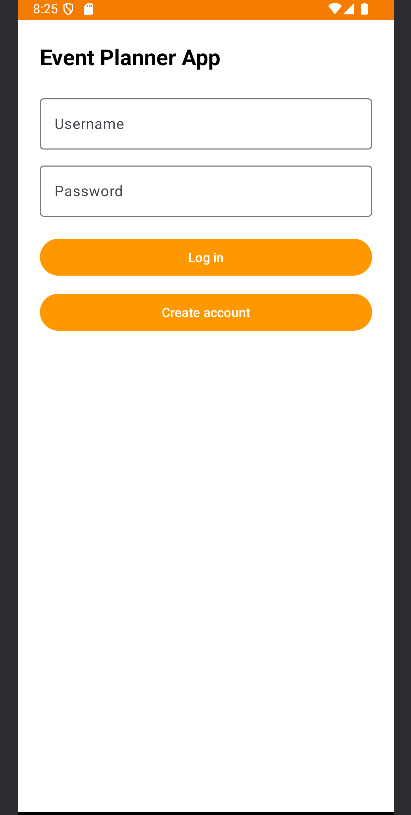
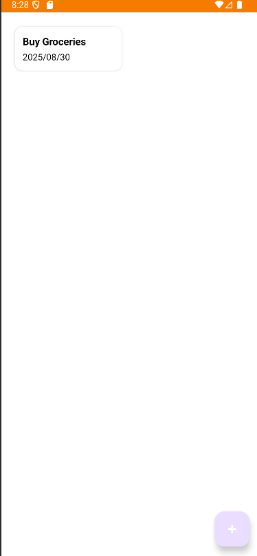

# Event Tracking App

This repository contains an Android mobile application developed for **CS 360: Mobile Architecture and Programming**. The app allows users to register, log in, create, edit, delete, and manage personal events with optional SMS reminder functionality.

## Project Overview

The goal of this project was to design and build a complete mobile application using Android development practices. The app focuses on user-centered design, persistent local storage, authentication flow, event management, and mobile permission handling.

## What This Project Demonstrates

- Android application development with Java
- User registration and login flow
- SQLite database design and local data persistence
- Create, read, update, and delete functionality for event records
- Event reminders and optional SMS notification support
- Android XML layouts and Material-style interface components
- Testing and debugging across activities, adapters, and database helper logic

## Tech Stack

- Java
- Android Studio
- SQLite
- Android XML layouts
- RecyclerView
- CardView
- Material Design Components

## Core Features

### User Authentication

Users can register and log in before accessing the event management features.

### Event Management

Authenticated users can create, edit, delete, and view events using a structured event list interface.

### Local Database Storage

The app uses SQLite to store user and event information locally on the device.

### SMS Reminder Option

The app includes optional SMS reminder functionality and demonstrates Android permission handling for notification-related features.

## Project Structure

```text
app/
  src/main/
    java/com/example/eventtrackingapp/
      AddEditEventActivity.java
      DBHelper.java
      Event.java
      EventAdapter.java
      LoginActivity.java
      MainActivity.java
      RegisterActivity.java
    res/layout/
      activity_add_edit_event.xml
      activity_event_list.xml
      activity_login.xml
      activity_register.xml
      activity_settings.xml
      grid_item_event.xml
      grid_item_layout.xml
    AndroidManifest.xml
```

## Screenshots

| Login Screen | Event List | Add/Edit Event |
|--------------|------------|----------------|
|  |  |  |

## Running the Project

1. Clone the repository:

```bash
git clone https://github.com/rypeguero/EventTrackingApp.git
```

2. Open the project in Android Studio.
3. Sync Gradle dependencies.
4. Run the app on an Android emulator or physical Android device.

## Security and Repository Hygiene

This repository is organized for portfolio review. Local build files, generated outputs, IDE-specific metadata, signing keys, and local environment files should not be committed. The `.gitignore` file is configured to keep the repository focused on source code and documentation.

## Reflection

This project strengthened my understanding of mobile application architecture, database-driven Android apps, activity navigation, permission handling, and iterative debugging. One major lesson was the importance of keeping the database schema aligned with the app's logic, especially when adding new functionality such as event deletion and SMS reminders.

## Future Improvements

- Replace SMS reminders with push notifications
- Add cloud backup and sync
- Improve password handling for a production-ready version
- Add automated UI and unit tests
- Add calendar integration

## Portfolio Framing

This project demonstrates a full mobile development workflow: planning, UI design, local database implementation, user authentication flow, event CRUD functionality, permission handling, debugging, and documentation.

**Author:** Ryan Peguero  
**Course:** CS 360 Mobile Architecture and Programming
